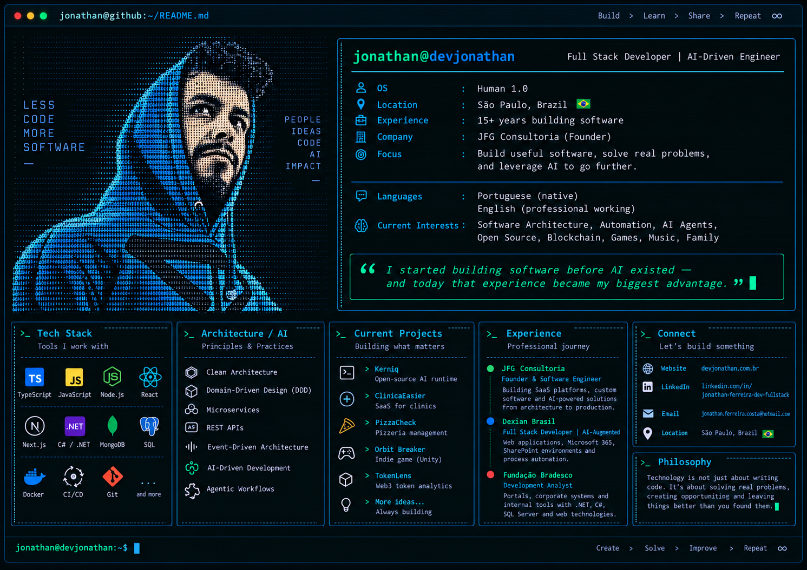

<div align="center">

# Jonathan Ferreira Gabriel

### Full Stack Developer · AI-Driven Engineering · Software Builder



</div>

---

## `whoami`

I started building software **before AI existed** — and today that experience became my biggest advantage.

I'm a **Full Stack Developer with 15+ years of experience** building production software — from enterprise portals and internal platforms to SaaS products, APIs, automations and AI-powered systems.

Today, I combine that foundation with **AI-Driven Engineering** — using AI as an active part of the engineering process while keeping architecture, validation and software quality under engineering ownership.

---

## `stack --core`

```yaml
languages:
  - TypeScript
  - JavaScript
  - C#
  - Python

frontend:
  - React
  - Next.js

backend:
  - Node.js
  - .NET
  - REST APIs
  - Microservices

data:
  - MongoDB
  - SQL / NoSQL

architecture:
  - Clean Architecture
  - Domain-Driven Design
  - Event-Driven Architecture

infrastructure:
  - Docker
  - CI/CD
  - Git

ai:
  - AI-Driven Development
  - AI-Augmented Engineering
  - Agentic Workflows
  - Prompt Engineering
```

---

## `experience --summary`

### JFG Consultoria — Founder & Software Engineer
Building SaaS platforms, custom software and AI-powered solutions from architecture to production.

### Dexian Brasil — Full Stack Developer / AI-Augmented Software Engineer
Web applications, Microsoft 365, SharePoint, corporate portals, intranets and process automation.

### Fundação Bradesco — Systems Analyst / Full Stack Developer
Nearly a decade across enterprise systems, .NET, SharePoint, APIs and SQL Server.

---

## `current-focus`

```text
> SaaS and independent digital products
> AI-native engineering workflows
> Open-source engineering tools
> Production-ready software
> International market
```

---

## `connect`

- Website: [devjonathan.com.br](https://devjonathan.com.br)
- LinkedIn: [jonathan-ferreira-dev-fullstack](https://www.linkedin.com/in/jonathan-ferreira-dev-fullstack)

```text
jonathan@dev:~$ _
```
