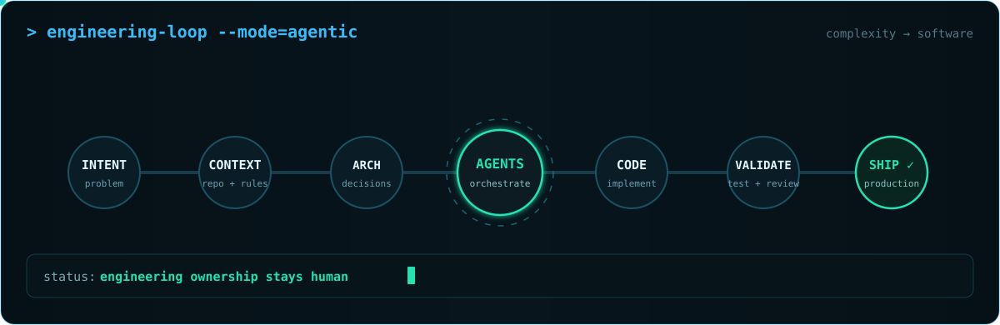

<div align="center">

# Jonathan Ferreira Gabriel

### Full Stack Developer · AI-Driven Engineering · Software Builder



<br/>


</div>

## `$ whoami`

I started building software **before AI existed** — and today that experience became one of my biggest advantages.

I'm a **Full Stack Developer with 15+ years of experience** building production software — from enterprise portals and internal platforms to SaaS products, APIs, automations and AI-powered systems.

My foundation was built through architecture, problem solving, debugging, maintainability and shipping real software. Today, I combine that foundation with **AI-Driven Engineering** — using AI as an active part of the engineering process while keeping technical decisions, validation and software quality under engineering ownership.

## `$ engineering --loop`

<div align="center">
  
</div>

## `$ stack --core`

```yaml
languages:      [TypeScript, JavaScript, C#, Python]
frontend:       [React, Next.js]
backend:        [Node.js, .NET, REST APIs, Microservices]
data:           [MongoDB, SQL, NoSQL]
architecture:   [Clean Architecture, DDD, Event-Driven Architecture]
infrastructure: [Docker, CI/CD, Git]
ai:             [AI-Driven Development, Agentic Workflows, Prompt Engineering]
```

## `$ current --builds`

```text
Kerniq          Open-source adaptive engineering runtime for coding agents
ClinicaEasier   SaaS platform for clinics
PizzaCheck      Operations and management software for pizzerias
Orbit Breaker   Mobile roguelike game
```

## `$ experience --summary`

**JFG Consultoria — Founder & Software Engineer**  
SaaS platforms, custom software and AI-powered solutions from architecture to production.

**Dexian Brasil — Full Stack Developer / AI-Augmented Software Engineer**  
Web applications, Microsoft 365, SharePoint, corporate portals, intranets and process automation.

**Fundação Bradesco — Systems Analyst / Full Stack Developer**  
Nearly a decade across enterprise systems, .NET, SharePoint, APIs and SQL Server.

## `$ philosophy`

```text
Less code for the sake of code.
More engineering.
More ownership.
Better software.
```

## `$ connect`

[Website](https://devjonathan.com.br) · [LinkedIn](https://www.linkedin.com/in/jonathan-ferreira-dev-fullstack)

```text
jonathan@dev:~$ _
```
